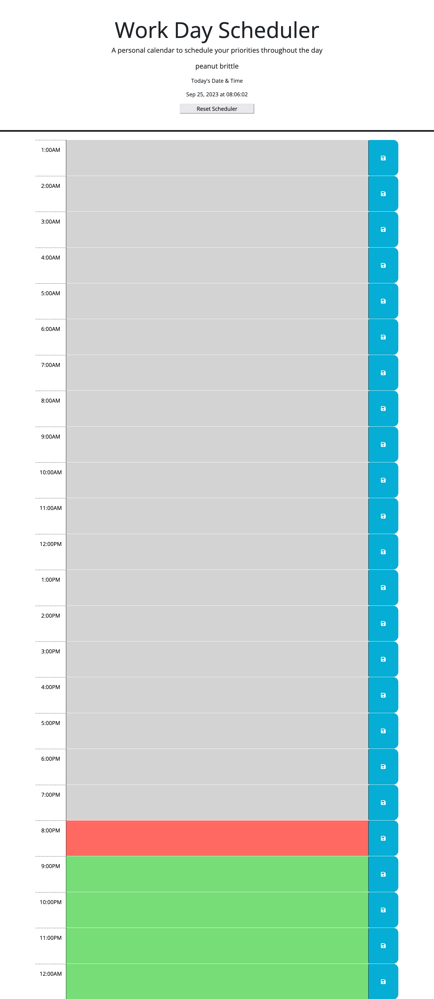

## WORKDAY SCHEDULER

## MOTIVATION
AS AN adult life can be busy. Having the ability to schedule your daily activities will stream line my daily routines and activities.
## DESCRIPTION
THIS APP allows a user to plan out their daily routines, as well as, saves the daily routines to keep track of them. The scheduler time slots change colors for past(gray), present(red), and future(green). The text boxes allow a user to type in ones task by the hour and save.
## PROBLEM AND SOLUTION
THE PROBLEM a users lack of scheduling has led to daily routines being missed or delayed. THE SOLUTION is to develop a daily scheduler that will stream line a users daily routines and activities.
## SITE ACCESS
# SITE: https://brian12345-webdev.github.io/DayPlanner/

# GITHUB: https://github.com/Brian12345-webdev/DayPlanner

